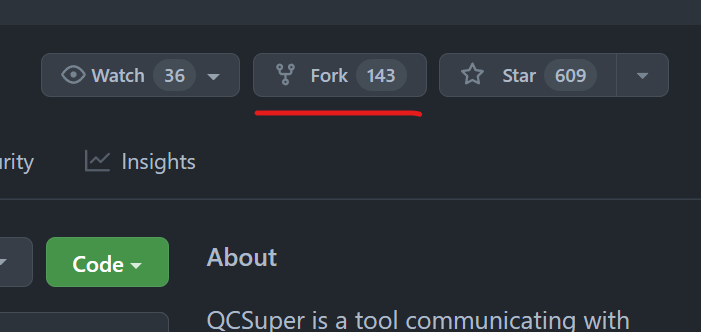

# University of Pennsylvania Game Research And Development Environment Game Jam 2022

Welcome, one and all to the first, official UPGRADE Game Jam! We are very pleased to officially declare this event OPEN!

## Description

From 11 am 10/29 to 10:30 am 10/30, you are now tasked wi.th creating a game from scratch. The goal for this game jam is for enable everyone participating to put everything they've learned over the past couple of weeks in UPGRADE to use. 
It's ok for the game to be rough.
It's ok for the game to be jank.
It's preferable that the game doesn't brick our computers.

## Theme: TRICK
Happy Halloween Weekend! This game jam's overarching theme is "TRICK". 

Any game concept you want is still fine, but teams will be receive bonus points if they are very well in line with the theme.

No, we will not expand what we mean by "TRICK"; it is open for your own interpretation.

It's important to note, however, that this project will be your OWN GROUP's project, not UPGRADE's (more on that in a minute).

## Specs
1. No gore, nudity, or anything you wouldn't want on your resume.
2. All art assets must be made in-house; they can be from pre-existing projects of your own, but they must be created by someone in your team.
3. All 3rd party code must be sourced; if it's from an open source repo, check their license
4. Public domain sound effects are good

Note:
1. Asset Request Channel is still open for this game jam; if an art asset is needed, Edward can freelance that for you, though moreso in a timely fashion than an artistically driven one.

## Submission Details
Forking a Repository creates an entirely separate copy of the original Repo on your own Github account; this allows you to retain more ownership of your game moving forward. Each team will create a fork of this initial repository; that fork will be the repo that that team works off of. The fork button is located at the top right.

Name your forked repo "[YourTeamName]-[YourGameName]"; to submit your game for judgement on 10/30, you will open a Pull Request for that Forked Repo.

A brief description of the game and a screenshot of your game's title screen are highly recommended for your game's ReadMe.

## Judging Criteria
Final judgement of the turned in games will be held by group vote; there will be 4 trophies up for grabs.
1. More Creative Use of the Theme
2. Best Production Value - Art
3. Most Robust Build - Code
4. Most Fun Game

GOOD LUCK!

